## MAYHEM en español
### Tutorial basico de como usar MAYHEM en español

#
Introduccion y comparacion del por que personalmente prefiero el ESP32-CAM :signal_strength:

Si cuentas con la Devboard original de Flipper Zero te daras cuenta que tiene wifi y bluetooth (es una ESP32-S2) y al igual que en todas puedes usar los firmwares del Wifi Marauder / Evil Portal.

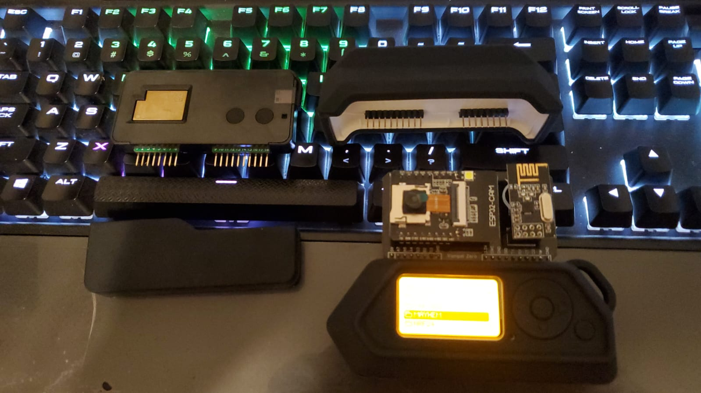
(por el Hype compre el Flipper Zero junto con la Wifi Devboard, el Video Game Module y las protobards)
#

Aqui la lista de ESP32 compatibles (ESP-8266 podria entrar en la lista para hacer deauther pero solo es Wifi):

- Flipper Zero WiFi Devboard :signal_strength:
- ESP32-S2 (El mismo chip ESP32 que viene en el WiFi Devboard) :signal_strength:
- ESP32-S2-WROVER :signal_strength:
- ESP32-WROOM :signal_strength:
- ESP32 Marauder Mini :signal_strength:
- ESP32-S3: signal_strength:
- Todas las AWOK ESP32 Boards :signal_strength:

*Nota: todos los Wifi son 2.4, si hay ESP32 con wifi 5.0(ESP32-C6) pero aun nadie saca un firmware para utilizarlo en el Flipper Zero.*

#

**A diferencia de los ESP32 mencionados el CAM tiene mas opciones:**

- Wifi☑
- Bluetooth☑
- Camara☑
- Ranura SD☑
- Led (flash para la camara)☑

**Por ende a alguien se le ocurrio hacer el firmware ya mencionado MAYHEM que hace mas cosas que solo deauther**

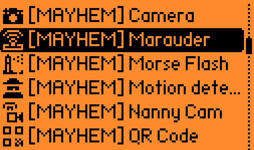

Al abrir cualquiera de esos saldra este mensaje si no detecta rapido el ESP32-CAM:

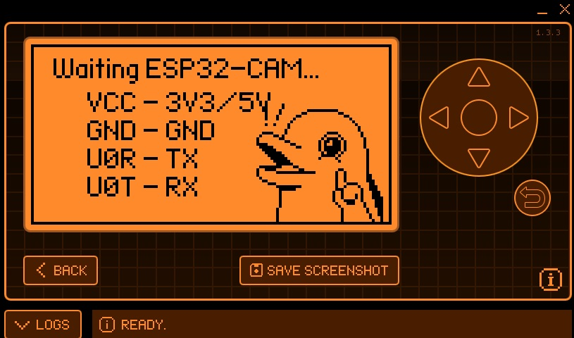

*Nota: si se queda pegado toca reiniciar o quitar y volver a insertar la board*

#

Que hace cada una de ellas:

- [MAYHEM] Camera: hace que en tu pantalla se vea la camara(como camara de gameboy) :camera:
  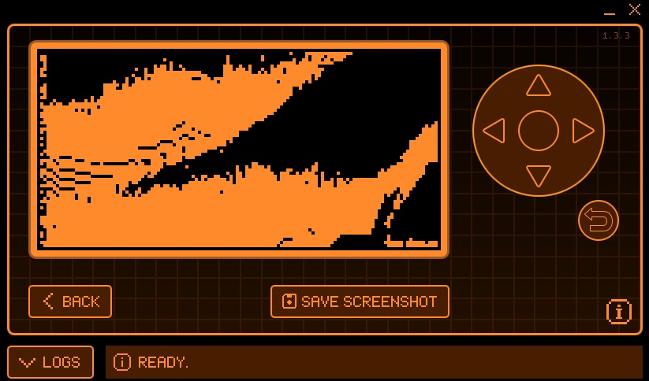
  
- [MAYHEM] Marauder: hace lo mismo que el wifi marauder(deauther a redes Wifi) :signal_strength:
  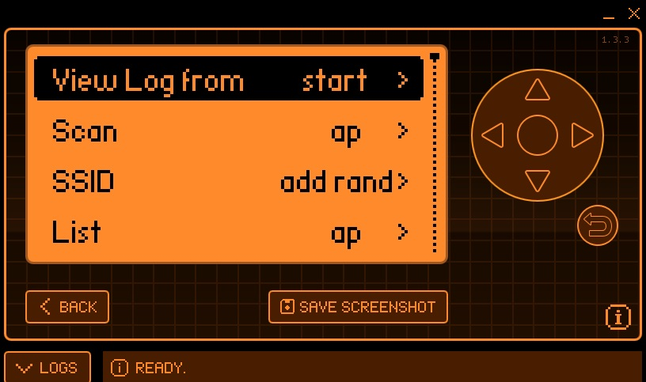
  
- [MAYHEM] Morse Flash: Codigo Morse usando el Led Flash, Por default trae el mensaje SOS, ET Call Home, pero si permite escribir nuevos mensajes :high_brightness:
  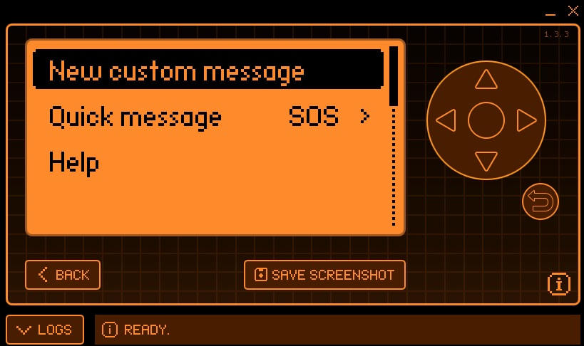
  
- [MAYHEM] Motion Detection: Deteccion de movimiento, deberas dejarla en un lugar fijo antes de iniciar para que la dejes hacer el learning, learning, learning :runner:
  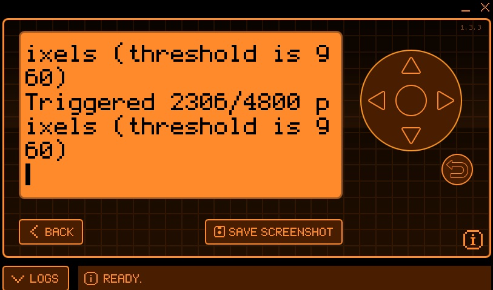
  
- [MAYHEM] Nanny Camera: es una camara que puedes accedes a ella por IP (te da una IP fija, usuario y contraseña) :video_camera: :signal_strength:
  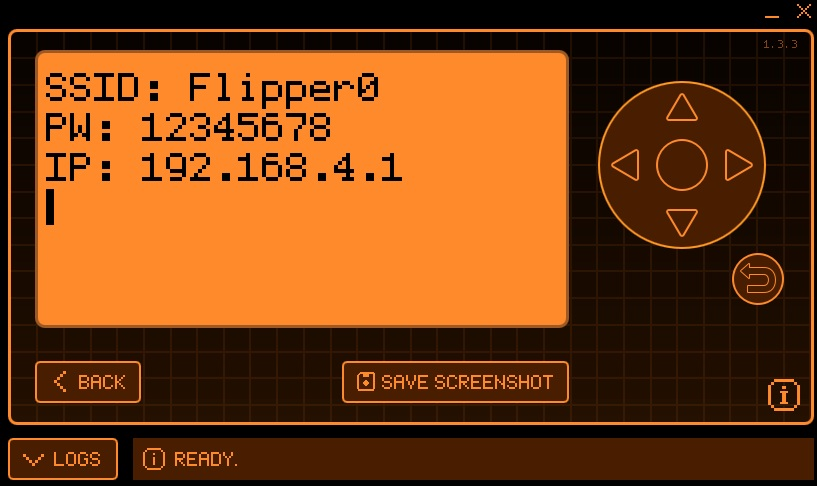
- [MAYHEM] QR Code: lector de codigos QR (este ultimo no lo eh hecho funcionar) :checkered_flag:
  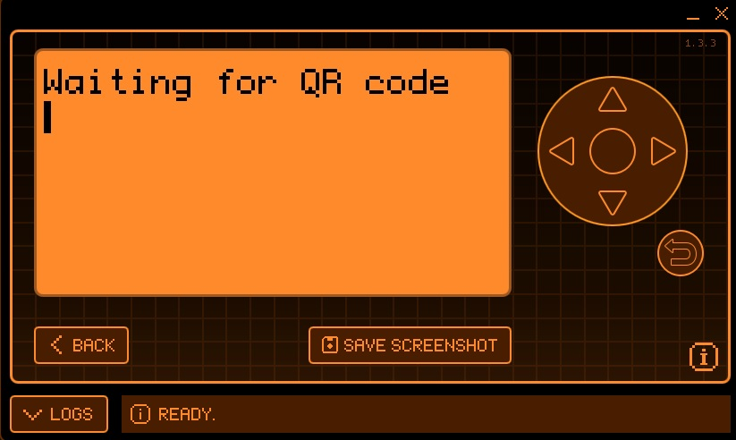

Hasta aqui seria todo lo que hace el firmware mayhem sobre el ESP32-CAM junto con la app MAYHEM en el fliper pero la Board MAYHEM que hay en el mercado (incluido la que diseñe aunque se llama MAY-HEM no, no se me fue el guion por error) se llaman MAYHEM porque en teoria hacen todo, que vendria siendo la descripcion de la palabra MAYHEM.

#

**nrf24l01** :signal_strength:

el nrf24l01 es un modulo de radiofrecuencia que trabaja en la 2.4Ghz y no, no tiene que ver con la wifi, en el Flipper Zero tiene varios usos pero solo hablaremos del Mouse Jacker para tener una idea de que hace:

Seleccionaremos en el Flipper Zero el NRF:
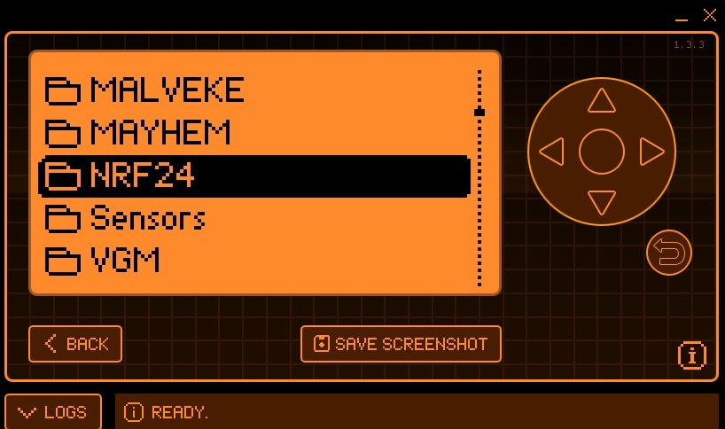

Y usaremos el Sniffer para escanear y detectar Mouse, teclados o kits(ambos) inalambricos:
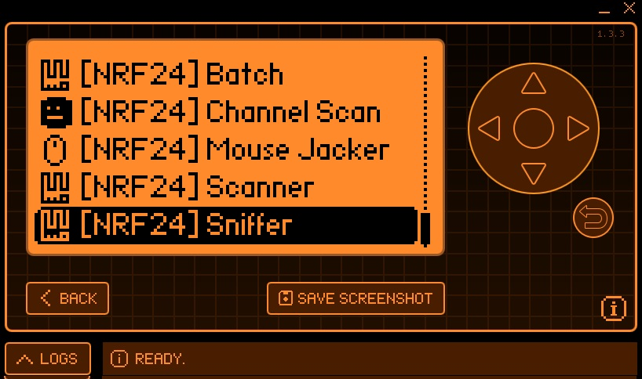

ya dentro daremos en el boton central :red_circle: para empezar a escanear/buscar dispositivos que trabajen a 2.4ghz :signal_strength:
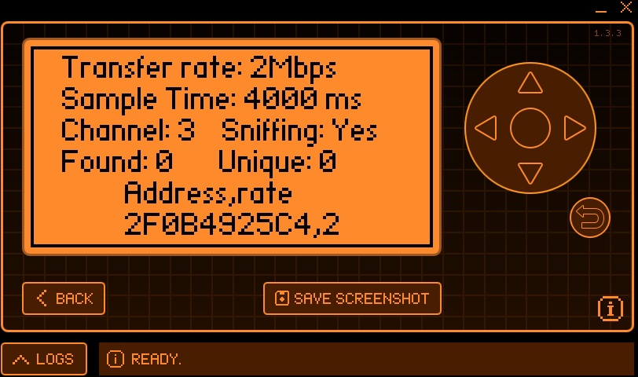

Una vez guardado ya puedes entrar a la opcion mouse jacker(si no sale error que no tiene nada el archivo .txt)

*PD. yo no pude capturar mouse por que el tengo es un Red Dragon ;[*

*Nota: se le agrega un capacitor de 10v 10uf para evitar perdida de energia cuando entra en accion la antena del NRF*

**En la Board que hice le meti un capacitor SMD para que casi no se note y no tener el tambito saliendo como en las MAYHEM de mas abajo en este post.**

#

**CC1101** :signal_strength:

Pues es el mismo que viene dentro del fliper, pero este al ser de antena tiene mayor alcance (hasta 480 metros segun fabricante).
El integrado en el Flipper zero es hasta 100 metros.

Al igual que con el CC1101 interno iremos a Sub-ghz
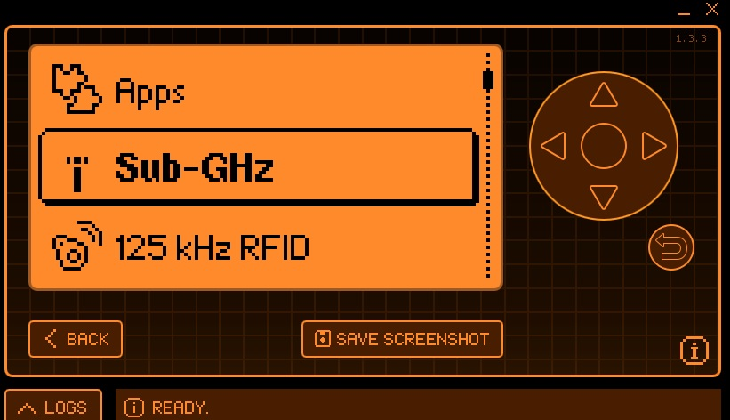

Ya dentro iremos hasta abajo del menu(Radio Settings):
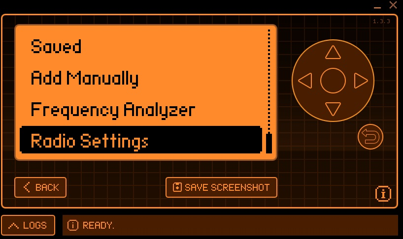

Y ahi podremos ver que si detecta la Antena como EXTERNAL:
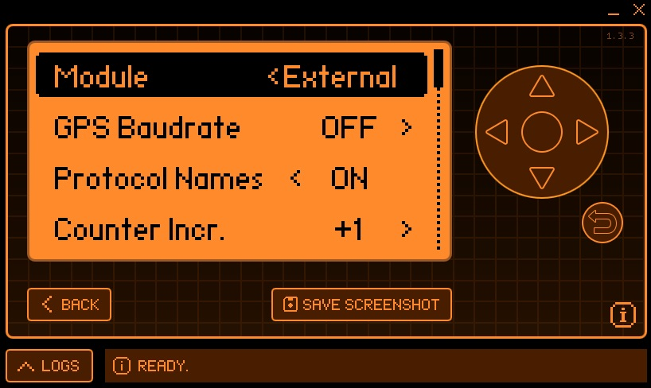
y si, si le das con las flechas de a lado :arrow_backward: :arrow_forward: cambiara a internal que seria la CC1101 interna del Flipper Zero(no te la deshabilita).

en las primeras opciones de Sub-ghz:
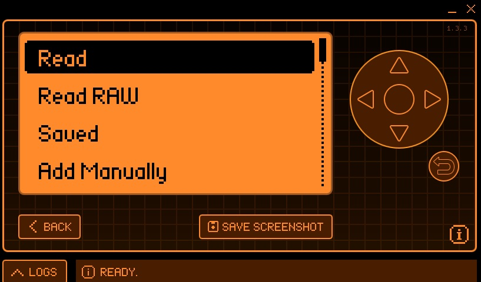

READ: comenzar a Escanear sub-frecuencias:
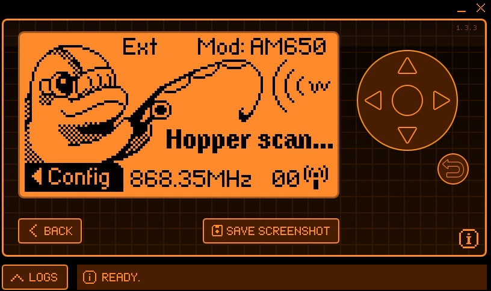

cuando detecte una señal pues la guardas ( como test usa un control de porton, de puerta, de pluma de parking, etc)

SAVED: es donde estaran todas tus sub-frecuencias guardadas:
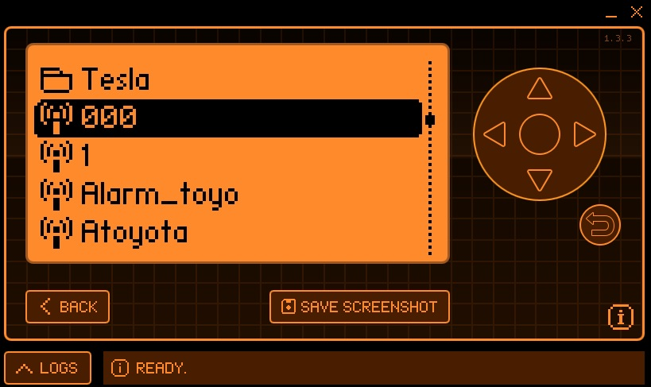

*Nota: depende del Firmware en tu Flipper Zero(firmware de flipper zero) algunas sub-frecuencias vienen bloqueadas..*

*Nota2: si, si se puede capturar Alarmas de c@rr0s.. (alarmas genericas)*

#

**En internet hay varias versiones pero los precios si se me hacen altos..** :money_with_wings:

  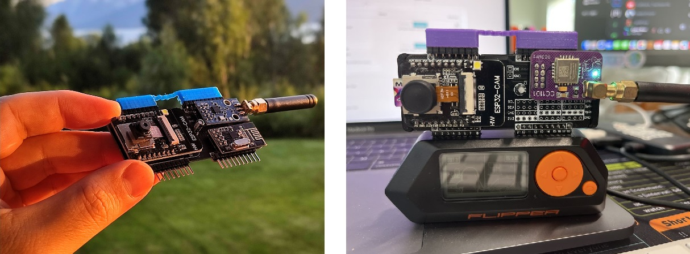
(Eried 115 dlls pero tu soldas todo y la cyber-bros la ultima vez que vi estaban en 85 dlls :heavy_dollar_sign: )

aqui precios tomados el dia 04/08/2024

La Mayhem de Eried (ya soldada y testeada):
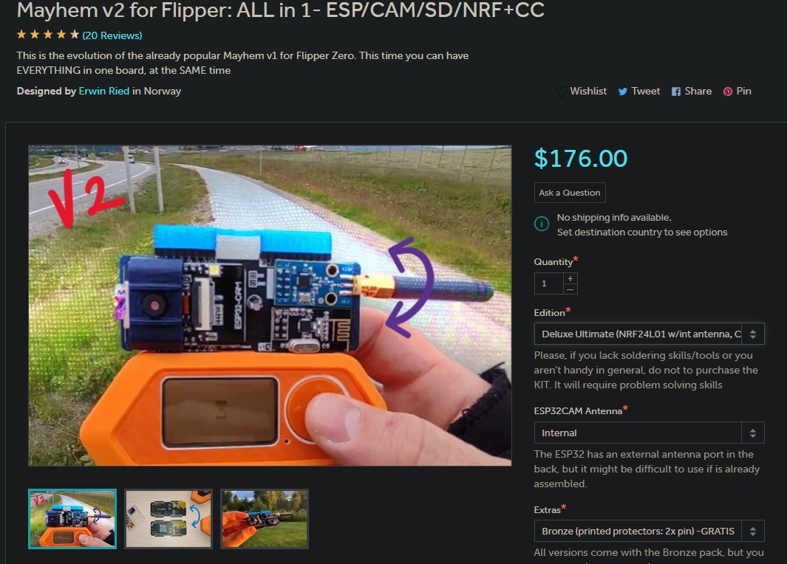

Orange Dragon(la descripcion dice solo la Board):
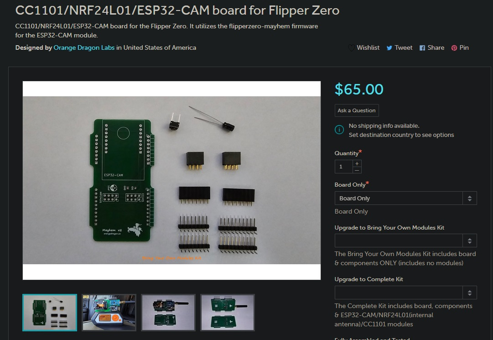
*Nota: las letras en la imagen dicen: Bring your own modules kit = tengas el kit de tus propios modulos... osea que si, es solo la board.*

*pd. Los precios son en Dlls* :heavy_dollar_sign: :money_with_wings:

#

**Los precios estan altos como ya mencione :money_with_wings: y si, si hay una forma economica de hacerlo.. que ocupas:free:?**

**Pues solo los modulos:**

Esta fue las pruebas que hice(salgo en la pantalla Xd):

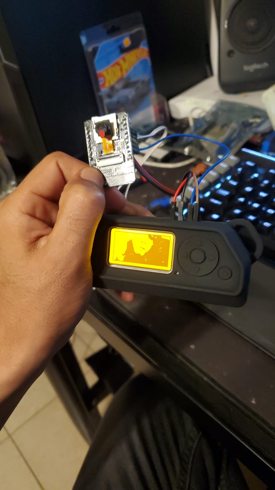

Aqui te dejo como debe de ir conectado el ESP32-CAM si quieres hacer pruebas tu mismo:

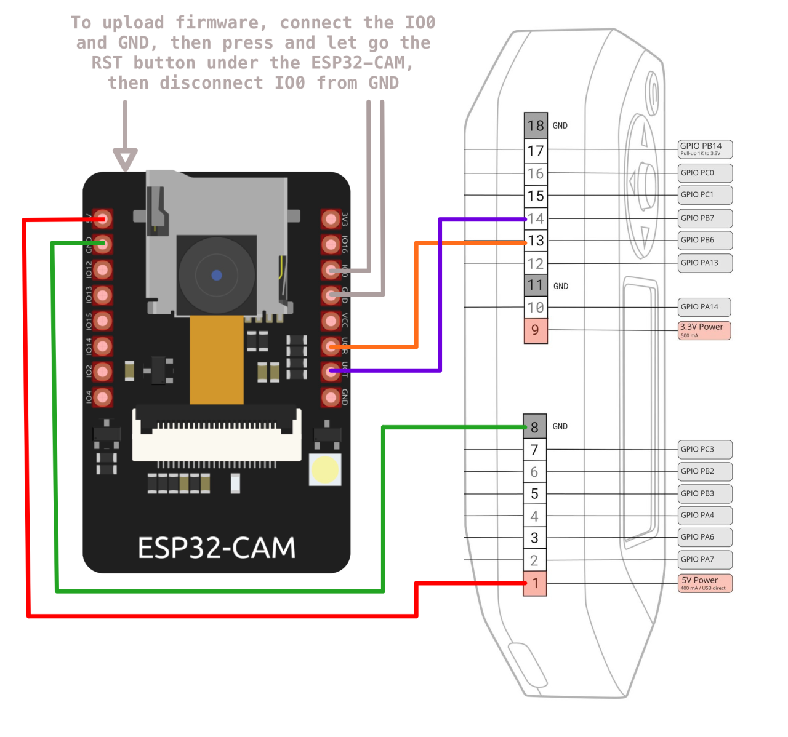

Aqui el nrf24l01:

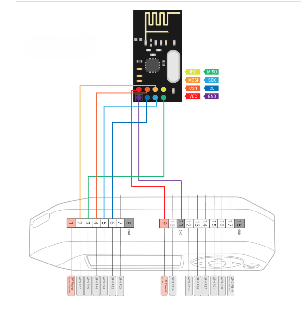

*Nota: El nrf24l01 y el CC1101 van conectados igual*

#

**Cargar firmware y apps en Flipper Zero**

1. El firmware MAYHEM solo se instala en el ESP32-CAM [web installer](https://flipper.ried.cl/webinstaller/).
2. Los FAPS(aplicacion en el flipper zero) estan en este [link](https://github.com/eried/flipperzero-mayhem/wiki/Compilation-of-the-faps).
3. Si en tu Flipper Zero tienes instalado el firmware [Xtreme-Firmware](https://github.com/Flipper-XFW/Xtreme-Firmware) o [MOMENTUM](https://github.com/Next-Flip/Momentum-Firmware) omite paso 2.

#

Despues de probar que todo funciono opte por soldar todo en las Protoboards originales del Flipper Zero:
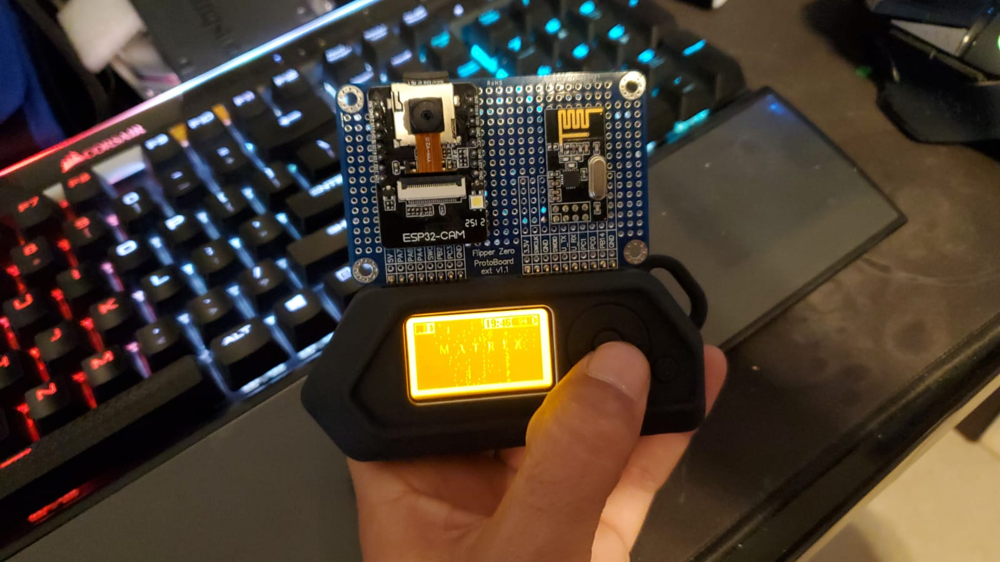
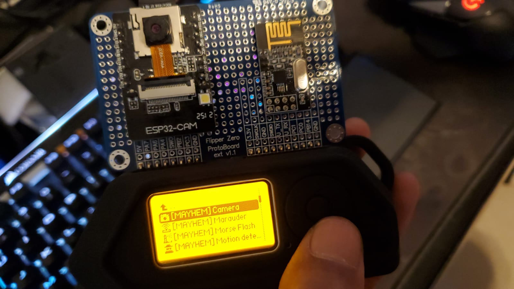

Si, en la v1.0(solo ESP32-CAM) y v1.1(ESP32-CAM y nrf24l01)  solde todo.. 

Por eso las siguientes versiones les agregue que se pudieran desprender(modular) y asi poder utilizar esos mismos modulos en otros proyectos como Arduino, raspberry, etc.

:link: Link a mi version 1.2 en Github: [MAY-HEM](https://github.com/vampel/may-hem)

**MAY-HEM.. HEM = Hecho En Mexico**

 
